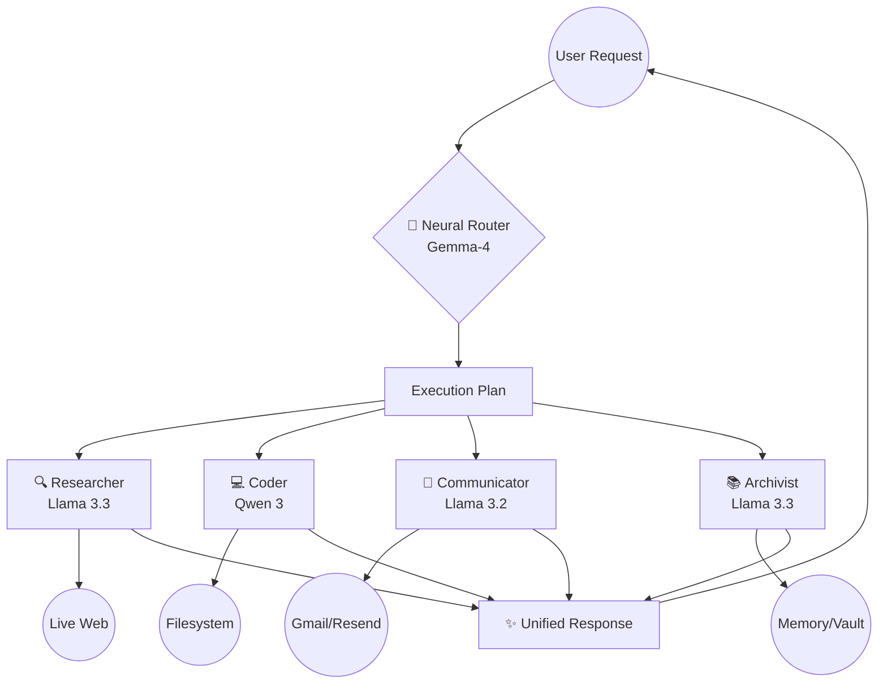

  

<h1 align="center">🧠 Omni-Agent V2</h1>

  <strong>The Future of Personal Intelligence — Smarter, Faster, and Built for Action.</strong>

  
  

---

## 🌟 What is Omni-Agent V2?

Omni-Agent is not just another chatbot. It is a **Cognitive Operating System** designed to handle your life's complexity. While basic AIs can only reply to messages, Omni-Agent can **research the live web**, **manage your calendar**, and **remember every important detail** you've ever mentioned.

### How it helps you every day:
- 🕵️ **Proactive Research**: Ask "What's the outlook for Nifty tomorrow?" and it scans live news, analyzes sentiment, and gives you a summary with sources.
- 🧠 **Persistent Memory**: Tell it "My sister is allergic to peanuts" once. Months later, if you ask for recipe ideas, it will automatically filter out peanut-based options.
- ✅ **Total Organization**: It understands natural language. "Remind me to call the bank tomorrow at 10 AM" instantly becomes a tracked task in your dashboard.
- ⚡ **Multi-Action Reasoning**: You can give complex commands like: *"Find the latest news on SpaceX and remind me to watch the launch tonight."* It splits this into research and task management automatically.

---

## 🧠 The Brain: Data-Driven Model Selection

We don't settle for "good enough." Omni-Agent V2 uses a **Hardened Multi-Model Expert Architecture**. Every request is handled by a primary expert, with an automatic fallback cascade through a verified registry of high-performance models.

| Role | Primary Model | Strength | Fallback Logic |
| :--- | :--- | :--- | :--- |
| **Orchestrator** | **Gemma 4 26B** | **MoE Reasoning**: Fast intent classification. | Verified Free Cascade + Auto-Retry |
| **Researcher** | **Llama 3.3 70B** | **Deep Synthesis**: Complex web research. | Hermes 3 405B |
| **Coder** | **Qwen 3 Coder** | **SOTA Coding**: Scripting & Debugging. | Llama 3.3 70B |
| **Communicator**| **Llama 3.2 3B** | **Action**: Emails, Reminders, & Routines. | Gemma 4 31B |

---

## ✨ New in V2: Actionable Agents

### 📧 The Communicator (Email & Scheduling)
V2 introduces a dedicated **Communicator Agent** that moves beyond chat to take real-world actions.
- **Professional Emailing**: Integrated with `Resend` and `Gmail`. You can say *"Send an email to John about the project update"* and the agent will draft, format, and send it.
- **Persistent Routines**: Built-in `APScheduler` support allows for recurring automation. 
    - *"Remind me every Monday at 9 AM to check my portfolio."*
    - *"Check the latest AI news daily at 8 PM and summarize it for me."*
- **Smart Scheduling**: Handles complex time logic. It knows what "next Tuesday" or "in 2 hours" means relative to IST.

### 📚 The Archivist (Secure Memory)
- **Vaulted Credentials**: Safely stores API keys and sensitive notes using encryption-ready pathways.
- **Semantic Retrieval**: Long-term memory that understands context, not just keywords.

### ⚡ Reliability & Hardening
- **Hardened Persistence Layer**: Reminders and routines are stored in a persistent `Supabase/SQLAlchemy` job store. They survive server restarts and redeployments on platforms like Render.
- **Auto-Reconciliation**: On startup, the system automatically syncs active routines from the database into the live scheduler, ensuring no recurring task is ever lost.
- **Smart Misfire Handling**: Configured with a 60-second misfire grace period to ensure background tasks execute even during high-load startup sequences.
- **Auto-Fallback**: If the primary model is rate-limited (429) or unavailable (503), the system instantly cycles through the fallback chain.
- **Cognitive Rules**:
    - **Credential Rule**: Strict separation between storing sensitive info (Archivist) and writing code (Coder).
    - **Multi-Intent Decomp**: Automatically splits complex tasks (e.g., "Email X and save my password") into parallel execution steps.
    - **Ambiguity Shield**: If intent confidence falls below 70%, the agent proactively asks for clarification instead of guessing.

---

## 🛠️ How it Works (The Architecture)

Omni-Agent uses a "Manager-Worker" pattern. Your request hits the **Neural Router**, which builds a Pydantic-validated execution plan and delegates work to specialized agents.

---

## 🌍 Global Standards: IST Optimized
Omni-Agent V2 is fully synchronized with **Indian Standard Time (IST)**. 
- All reminders, timestamps, and "tomorrow" calculations are based on your local time.
- Historical data has been migrated to ensure consistency across the entire platform.

---

## 🚀 Getting Started

### Backend Setup
1. Clone the repo and install dependencies: `pip install -r requirements.txt`
2. Configure `.env` with:
   - `OPENROUTER_API_KEY`
   - `TAVILY_API_KEY`
   - `RESEND_API_KEY`
   - `SUPABASE_URL` & `SUPABASE_KEY`
   - `SUPABASE_DB_URL` (PostgreSQL connection string for persistence)
3. Run: `uvicorn main_v2:app --host 0.0.0.0 --port 8000`

### Frontend Setup
1. `cd frontend && npm install`
2. `npm run dev`

---

  Built with ❤️ for the Next Generation of AI Agents by <a href="https://github.com/Danish2op">Danish Sharma</a>

