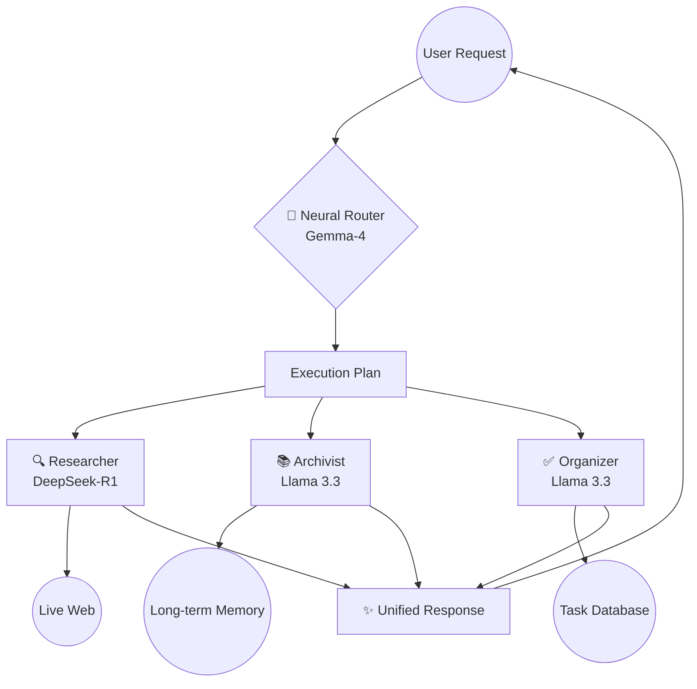

  

<h1 align="center">🧠 Omni-Agent V2</h1>

  <strong>The Future of Personal Intelligence — Smarter, Faster, and Built for Action.</strong>

  
  

---

## 🌟 What is Omni-Agent V2?

Omni-Agent is not just another chatbot. It is a **Cognitive Operating System** designed to handle your life's complexity. While basic AIs can only reply to messages, Omni-Agent can **research the live web**, **manage your calendar**, and **remember every important detail** you've ever mentioned.

### How it helps you every day:
- 🕵️ **Proactive Research**: Ask "What's the outlook for Nifty tomorrow?" and it scans live news, analyzes sentiment, and gives you a summary with sources.
- 🧠 **Persistent Memory**: Tell it "My sister is allergic to peanuts" once. Months later, if you ask for recipe ideas, it will automatically filter out peanut-based options.
- ✅ **Total Organization**: It understands natural language. "Remind me to call the bank tomorrow at 10 AM" instantly becomes a tracked task in your dashboard.
- ⚡ **Multi-Action Reasoning**: You can give complex commands like: *"Find the latest news on SpaceX and remind me to watch the launch tonight."* It splits this into research and task management automatically.

---

## 🧠 The Brain: Data-Driven Model Selection

We don't settle for "good enough." Omni-Agent V2 uses a **Multi-Model Expert Architecture**. Every request is handled by the model best suited for that specific task, backed by industry-standard benchmarks.

| Model | Role | Key Benchmark (MMLU) | Specialty |
| :--- | :--- | :--- | :--- |
| **Gemma 4 26B A4B** | **Orchestrator** | **82.6%** | **Mixture-of-Experts (MoE)**: Reasoning & Dispatch. |
| **DeepSeek-R1** | **Researcher** | **90.1%** | **SOTA Reasoning**: 97.3% Math & 96.3% Coding accuracy. |
| **Llama 3.3 70B** | **Archivist** | **86.0%** | **Logical Consistency**: 88.4% HumanEval (Coding). |

### ⚡ Why Gemma 4 26B A4B?
We chose this as our primary **Orchestrator** because of its innovative **Mixture-of-Experts (MoE)** architecture. It has 25.2 Billion parameters in total, but only activates 3.8 Billion per token. This gives you **GPT-4 class reasoning speed** with the efficiency of a much smaller model, ensuring your assistant responds in milliseconds.

---

## 🛠️ How it Works (The Architecture)

Omni-Agent uses a "Manager-Worker" pattern. Your request hits the **Neural Router** (Gemma-4), which builds an execution plan and delegates work to specialized agents.

---

## 🌍 Global Standards: IST Optimized
Omni-Agent V2 is fully synchronized with **Indian Standard Time (IST)**. 
- All reminders, timestamps, and "tomorrow" calculations are based on your local time.
- Historical data has been migrated to ensure consistency across the entire platform.

---

## 🚀 Getting Started

### Backend Setup
1. Clone the repo and install dependencies: `pip install -r requirements.txt`
2. Configure `.env` with:
   - `OPENROUTER_API_KEY`
   - `TAVILY_API_KEY`
   - `SUPABASE_URL` & `SUPABASE_KEY`
3. Run: `uvicorn main:app --reload`

### Frontend Setup
1. `cd frontend && npm install`
2. `npm run dev`

---

  Built with ❤️ for the Next Generation of AI Agents by <a href="https://github.com/Danish2op">Danish Sharma</a>

